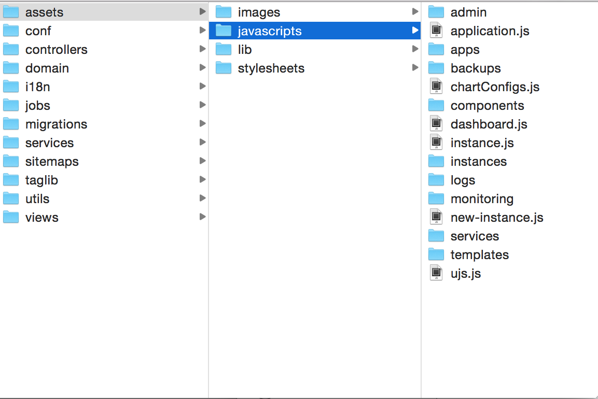
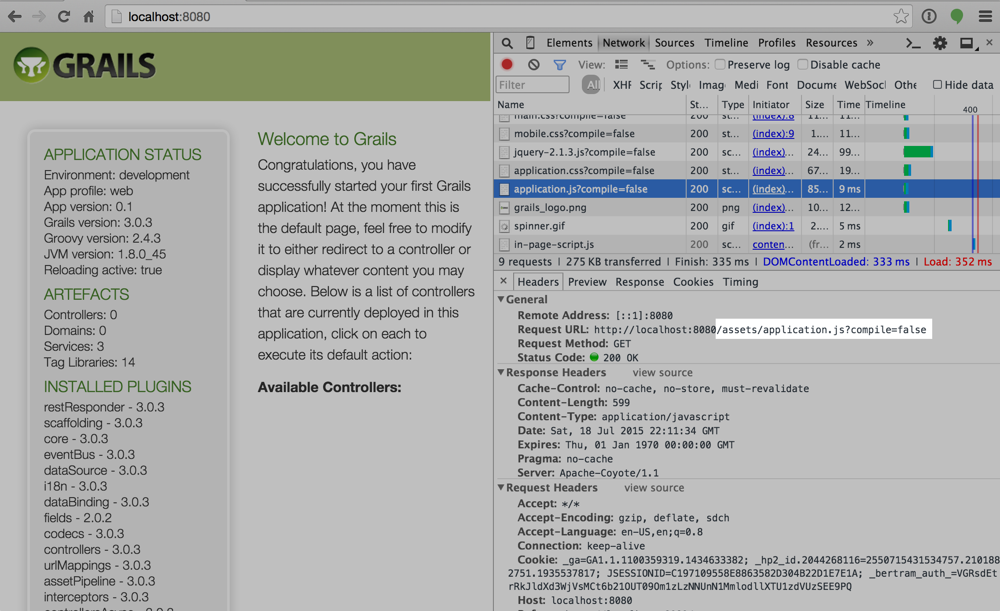
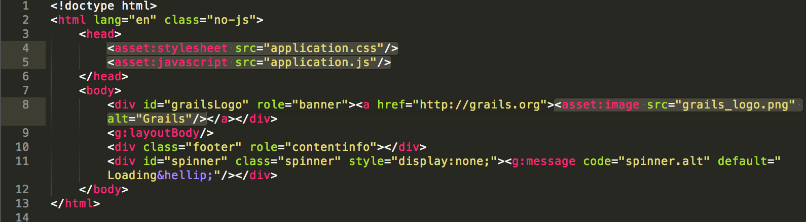
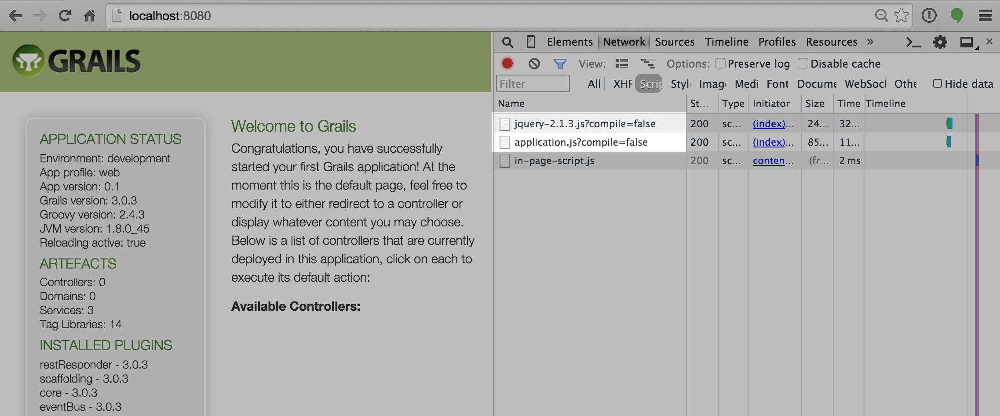
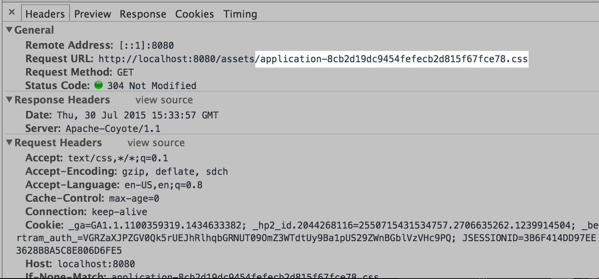

slidenumbers: true


## Presented by David Estes (@davydotcom) __#asset-pipeline__


---

# What is Asset-Pipeline?

A library for both rapid development iteration and optimized production handling of static and not-so-static assets.

---

# What will we cover?

* Development cycle: On the fly processing and transpiling of assets
* Popular extension plugins
* Production tuning with Grails
* Digesting and cache headers
* Other frameworks

--- 

# Whats new in Version 2.x

* 2-10x Faster than the 1.x.x Series
* Resolvers
* Easier Extensibility
* Framework Decoupling (Works with Grails3, Ratpack, Spring Boot, Gradle, etc.)
* Improved Relative Path recalculations

---

# The 'assets' folder

* First subfolder is for organizational use. (i.e. images, fonts, stylesheets,javascripts)
* This is never used in the request path and is essentially flattened out



---

While the file is stored in `assets/javascripts/application.js`, the request is simply made at: `/assets/application.js`



---

# Resolvers

The means with which the asset-pipeline resolves files requested as well as imported. There are several base resolver types:

* Filesystem
* Jar
* Classpath

**NOTE**: Resolvers are only used in development mode as well as build time. They are not used during production.

---

# Grails Resolvers

Resolvers are registered for the main `grails-app/assets` folder and each plugin. 
* **Binary Plugins:** `META-INF/assets`. (pre-flattened)
* **Source Plugins:** `$pluginPath/grails-app/assets`
* **Binary Dependencies:** `META-INF/static` and `META-INF/resources`

---

# Gradle Resolvers

Customizable but defaults to the `src/assets` folder.

```groovy
assets {
  sourceDir = 'src/assets'
  compileDir = "$buildDir/assets"
}
```

---

# Bundling

* Directives
* Encoding

---

# What are Directives

File annotations that allow for the inclusion of other files, as well as the assignment of file options.

* `//= require jquery`
* `//= require_tree .`
* `//= require_self`
* `//= encoding UTF8`

---

# Bundling Javascript

Sample `application.js` file taken from grails: 

```javascript
// This is a manifest file that'll be compiled into application.js.
//
// Any JavaScript file within this directory can be referenced here using a relative path.
//
// You're free to add application-wide JavaScript to this file, but it's generally better 
// to create separate JavaScript files as needed.
//
//= require jquery-2.1.3.js
//= require_tree .
//= require_self

if (typeof jQuery !== 'undefined') {
    (function($) {
        $('#spinner').ajaxStart(function() {
            $(this).fadeIn();
        }).ajaxStop(function() {
            $(this).fadeOut();
        });
    })(jQuery);
}

```
---

# Bundling Stylesheets

Sample `application.css` taken from grails:

```css
/*
* This is a manifest file that'll be compiled into application.css, which will include all the files
* listed below.
*
* Any CSS file within this directory can be referenced here using a relative path.
*
* You're free to add application-wide styles to this file and they'll appear at the top of the
* compiled file, but it's generally better to create a new file per style scope.
*
*= require main
*= require mobile
*= require_self
*/

```

---

# Encoding

Source encoding can be specified within each individual javascript file

```javascript
//=encoding UTF-8
```

Output encoding can be customized with param:

```
http://localhost:8080/assets/application.js?encoding=utf-8
```

---

# Taglibs

* Javascript
*  Stylesheets
* Images
* Deferred scripts

---

# Sample Grails Layout



*NOTE*: No Need to specify `assets/` folder in path

---

# Debug Mode

In Development the taglib will include each file individually rather than bundled. This makes it easier to debug your javascript in real time



---

# Deferred Scripts

Added to facilitate easier transition from the Resources plugin but not recommended.

```jsp
<asset:script type="text/javascript">
  console.log("Hello World");
</asset:script>
<asset:script type="text/javascript">
  console.log("Hello World 2");
</asset:script>
```

Now to render the output of these scripts simply use the following:

```jsp
<asset:deferredScripts/>
```
---

# Scoping Javascript to a Page

Use a `class` or `data-page` attribute on your body tag to selectively trigger javascript. This allows you to seperate your javascript from your view and keep it all bundled in one file.

---

# On the fly

* Why not watched?
*  Cache
* Advantages over Gulp or Grunt

---

# Why not Watched Files?

* Slow
* Delay between saving and being able to refresh your browser
* Gets exponentially worse the bigger the project
* Doesn't stack well with other watch type transpilers in a project

---

# Instant Gratification

When a file is changed, you can refresh your browser and see your changes instantly. Allows for a faster iteration.

---

# Development Runtime Cache

Processed files are cached in memory, and given a cache dependency tree. Asset-Pipeline serves from this cache unless the file has changed since the last cache.

---

# Gulp and Grunt

* Not just a build tool
* Tightly integrated with your framework for a more seemless workflow
* No watched resources in development
* Less development dependencies

---

# CSS Goodies

* Recalculated relative urls
* Minification

---

# LESS 

```groovy
compile 'com.bertramlabs.plugins:less-asset-pipeline:x.x.x'
```

* Standard vs. Less4j
* Use less4j
* Clean debugging output in your logs
* Use imports instead of directives

^ Talk about naming files with `.less` extension but still requesting them as `.css`

---

# CoffeeScript

```groovy
compile 'com.bertramlabs.plugins:coffee-asset-pipeline:x.x.x'
```

* Each file is isolated scoped
* Sourcemaps coming soon
* Different directive pattern `#= require blah`
* Uses nodejs coffee plugin if detected for faster compile

^ Talk about `.coffee` extension and debugging support

---

# Handlebars

```groovy
compile 'com.bertramlabs.plugins:handlebars-asset-pipeline:x.x.x'
```

* Bundle all templates in one js file (template cache)
* Configurable template prefix to control your template names by path
* Embedded handlebars library, or override by including your own

--- 

# SASS Compass

```groovy
compile 'com.bertramlabs.plugins:sass-asset-pipeline:x.x.x'
```

* Powerful and elegant
* Compass baked in (some restrictions)

---

# SASS Customizations

This plugin uses `jruby-container` to isolate your Jruby gemsets and prevent corruption by your environment.

* Can customize a list of additional gem dependencies (such as `bourbon`)
* Always evaluates a `config.rb` file if detected in the same path as the SASS file being compiled

---

# SASS Limitations

* Compass requires some monkey patching. SASS itself does not.
* Sprite Generation support still being refactored
* Jruby is a hog atm

---

# Production!

* Digests
* Etags
* CDNs
* External storagepath
* Custom request urls
* Minification
* More SPEED!

---

# Digests

MD5 Suffiix appended to the end of a filename. Used for cache busting consistently across browsers and proxies. i.e.



^ Also useful for rolling restarts (more on that later)

---

## Packaging

* Assets are packaged in your container's `assets` folder along with a manifest.properties file.
* Manifest allows for both diff level compiling and proper etags when requesting by non digested name
* We don't force digest only request handling.

---

## Excludes / Includes

* Partial files are automatically excluded `**/_*.*`
* Common patterns
	* Uses GLOB patterns i.e. `**/*.js` or `**/*.less`
* Common mistakes
	* Don't factor in your organizational assets subfolders
* Use Bower Installer

---

## Minification

* Closure compiler uses Rhino's AST parser (not runtime)
* Much more efficient than uglifyjs
* Sourcemaps
* Angular JS hates to be small ( but it can be done)

---

# Other Plugins

* cdn-asset-pipeline
* jsx-asset-pipeline
* angular-templates-asset-pipeline
* ember-asset-pipeline
* more...

---

# Additional Resources

* __Documentation:__ [http://bertramdev.github.com/asset-pipeline](http://bertramdev.github.com/asset-pipeline)
* __Github:__ [http://github.com/bertramdev/asset-pipeline-core](http://github.com/bertramdev/asset-pipeline-core)
* __Angular Asset-Pipeline:__ @craigburke

---

# Questions?
